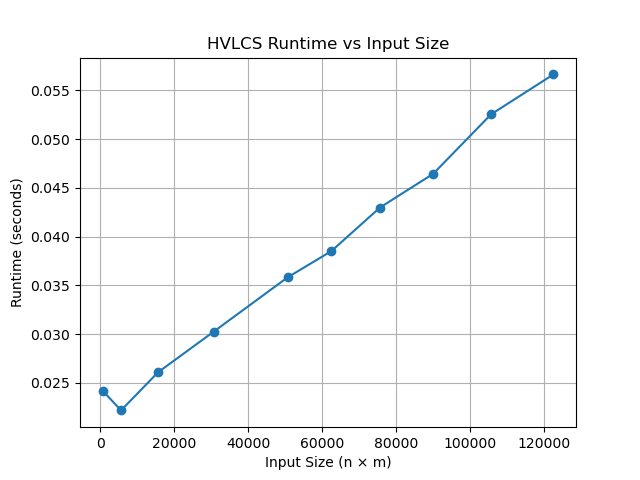

# Programming Assignment 3: Highest Value Longest Common Sequence
Name: Nam Tran

UFID: 19547941

## Project Description
This project solves the Highest Value Longest Common Subsequence (HVLCS) problem using dynamic programming.

## Repository Structure

```text
.
├── data/
│   ├── input/
│   │   ├── ex1.in
│   │   ├── ex2.in
│   │   ├── ex3.in
│   │   └── ex4.in
│   │
│   ├── output/
│   │   ├── ex1.out
│   │   ├── ex2.out
│   │   ├── ex3.out
│   │   └── ex4.out
│
├── test/
│   ├── test1.in
│   ├── test2.in
│   ├── test3.in
│   ├── test4.in
│   ├── test5.in
│   ├── test6.in
│   ├── test7.in
│   ├── test8.in
│   ├── test9.in
│   └── test10.in
│
├── plot_image/
│   └── runtime_graph.png
│
├── src/
│   ├── hvlcs.py #main HVLCS solution
│   ├── q1_plot.py #plotting script for question 1
│   └── q1_runtime.py #runtime measurement script for question 1
│
└── README.md
```
- `src/` contains the Python implementation of HVLCS and scripts for analysis
- `data/input/` contains example input files
- `data/output/` contains corresponding output files
- `test/` contains the test input files for runtime measurement in question 1
- `plot_image/` contains the generated runtime graph

## Running Repository
After cloning the repository, run the following commands in command prompt or gitbash. 
You will run the program with an input file.
Example:
```text
python3 src/hvlcs.py < data/input/ex1.in > data/output/ex1.out
#output will be written to the out file in the data/output/ folder
```

Example output:
```text
9
cb
```
You can test other files the same way.

## Reproducing Runtime Graph

Step 1: Run the runtime measurement script:
```text
python3 src/q1_runtime.py
```
This will run the HVLCS algorithm on all test files, measure and print runtime results in this format:
```text
sizes = [...]
times = [...]
```
Step 2: Plot the runtime graph
Run the plotting script:
```text
python3 src/q1_plot.py
```
This will generate a graph of runtime vs input size and save it as plot_image/runtime_graph.png.

## Written Component

### Question 1: Empirical Comparison
### Use at least 10 nontrivial input files (i.e., contain strings of length at least 25). Graph the runtime of the 10 files.

| Input Size (n × m) | Runtime (seconds) |
| ------------------ | ----------------- |
| 625                | 0.0242            |
| 5625               | 0.0222            |
| 15625              | 0.0261            |
| 30625              | 0.0302            |
| 50625              | 0.0358            |
| 62500              | 0.0385            |
| 75625              | 0.0430            |
| 90000              | 0.0464            |
| 105625             | 0.0525            |
| 122500             | 0.0566            |


The runtime generally increases as input size increases.

### Question 2: Recurrence Equation
### Give a recurrence that is the basis of a dynamic programming algorithm to compute the HVLCS of strings A and B. You must provide the appropriate base cases, and explain why your recurrence is correct.
Let OPT(i, j) denote the maximum value of a common subsequence between the first i characters of string A and the first j characters of string B.

Base cases are:
```text
OPT(0, j) = 0
OPT(i, 0) = 0
```

Recurrence:
```text
If characters match: OPT(i, j) = max(OPT(i-1, j), OPT(i, j-1), OPT(i-1, j-1) + value(A[i-1]))
Otherwise: OPT(i, j) = max(OPT(i-1, j), OPT(i, j-1))
```

Justification:
At position (i,j), an optimal solution must fall into one of the following cases:
- Skip the last character of A
- Skip the last character of B
- Match the characters if they are equal

These cases cover all possibilities for constructing a common subsequence. Since the recurrence considers all valid choices and takes the maximum, it correctly computes the optimal value.

### Question 3: Big-Oh
### Give pseudocode of an algorithm to compute the length of the HVLCS of given strings A and B. What is the runtime of your algorithm?
Pseudocode:
```text
for i from 0 to n:
  dp[i][0] = 0
for j from 0 to m:
  dp[0][j] = 0
for i from 1 to n:
  for j from 1 to m:
    dp[i][j] = max(dp[i-1][j], dp[i][j-1])
    if A[i-1] == B[j-1]:
      dp[i][j] = max(dp[i][j], dp[i-1][j-1] + value[A[i-1]])
```

Complexity
- Time Complexity: O(n*m)
- Space Complexity: O(n*m)
